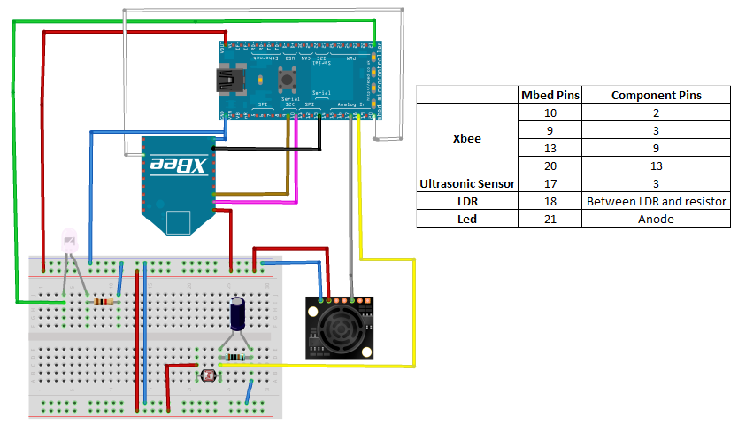
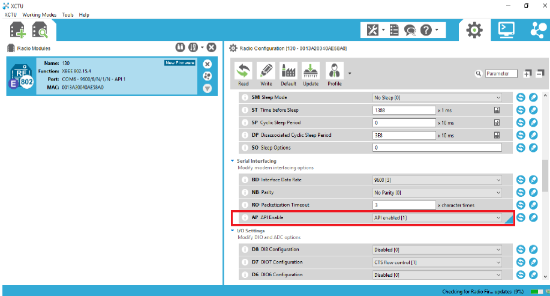
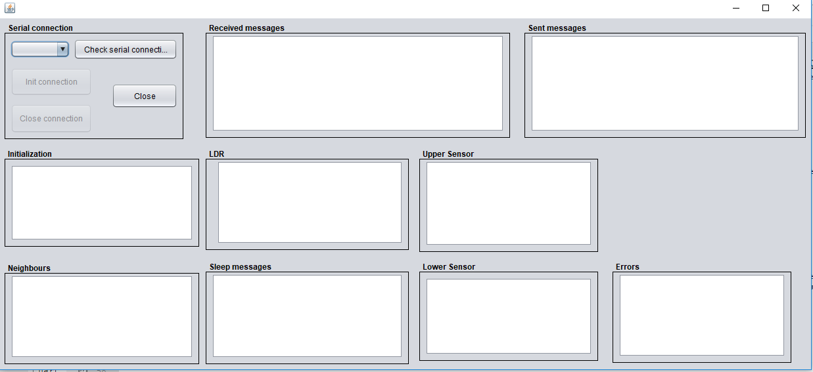

# Smart street lighting control network using Mbeds

This project was developed for the Networked Embedded Systems course. It consists on a network of nodes capable of detecting cars passing nearby (using ultrasonic sensors), lighting up the street only when necessary. When a sensor detects one car, the node should light up its own led and send a radio message (using Xbees) to the node the car is heading to, making it also light up its own led. The led is switched off after no cars are detected for a given time. Also, LDRs are used for periodically checking if there already is enough environment light, which will save some energy as the led action is not necessary. 

The system works in a dynamic and distributed manner as, in runtime, new nodes can be added or removed to the system (which means that each node only knows which are its adjacent nodes in runtime) and there is no central node (no single point of failure). 

## Hardware

The system was tested with three nodes. For the nodes on the edges, only one ultrasonic sensor is required as those nodes only have one adjacent node. On the other hand, all the nodes that are not on the edges must have two ultrasonic sensor. Each node is basically composed by:

**MB1200:** [ultrasonic sensor](https://www.maxbotix.com/Ultrasonic_Sensors/MB1200.htm) for detecting cars 

**Xbee 802.15.4:** [radio frequency module](https://www.digi.com/products/embedded-systems/rf-modules/2-4-ghz-modules/xbee-802-15-4) for communication between nodes

**LDR:** [light sensor](https://uk.rs-online.com/web/c/displays-optoelectronics/optocouplers-photodetectors-photointerrupters/ldr-light-dependent-resistors/) for checking if environment light is enough for the street visibility

**Led:** for artificially lighting up the street

**Mbed:** [microcontroller](https://os.mbed.com/platforms/mbed-LPC1768/) chosen for interfacing all the components above

## Connections



## Software

For programming the Mbed, you need to use their [online compiler](https://os.mbed.com/ide/). After creating a project (for the model LPC1768) and after adding the files inside the src folder (which will be described below), you need to add these three libraries: [DigiLogger](https://os.mbed.com/teams/Digi-International-Inc/code/DigiLogger/), [freertos-cm3](https://os.mbed.com/users/fep/code/freertos-cm3/) and [XBeeLib](https://os.mbed.com/teams/Digi-International-Inc/code/XBeeLib/).

The src folder contains three files: the c++ script (main.cpp), one .h file used by the Xbee library (contains, among other things, the mbed pinout) and one .txt file. This last .txt file is very important, as it must be pasted in the USB accessible storage space of each mbed (with different values). The first two values are the "m" and "b" values related with the [LDR calibration](https://www.instructables.com/id/Measuring-Light-Using-Light-Sensor/). Note that this procedure must be done for each individual node as the LDRs may have different characteristics. The last value must be one of these three values: 0 (means it only has one adjacent node on the right), 1 (only has one adjacent node on the left) or 2 (has two adjacent nodes).

It is important to highlight that the FreeRTOS system was used in order to allow executing all the system threads (LDR reader, LED task, ultrasound task, radio receiver, neighbour discovery and retransmission task) in a preemptive mode as it takes care of scheduling those tasks.

## Xbee configuration

Before being ready to test the system, there are three parameters that need to be configured for each individual Xbee. Using the [XCTU software](https://www.digi.com/resources/documentation/digidocs/90001458-13/default.htm), you need to setup the module in the API mode (see image below), set the same Channel Number and Personal Area Network (PAN) to all the modules (default values are 0x1A and 0xD161 respectively) and choose an unique node ID for each Xbee. Note that this node ID is very important, as its value indicates the relative position of the node in the street. For instance, if you have three nodes with IDs 1, 2 and 3, it means that the node 1 is the leftmost so it only has one adjacent node on right (node 2), node 2 is in the center and has two adjacent nodes (nodes 1 and 3) and node 3 is the rightmost (only has one adjacent node on the left).



## Instructions summary

To sum up everything explained above:

1) Create project on the Mbed compiler, add the main.cpp and config.h files present on the src folder and add the three libraries mentioned above.

2) Calibrate the LDR of each node (following the instructions of the link mentioned above) and insert the "m" and "b" values on the individual .txt file. Also, indicate on that file if the node is a left edge, right edge or a center node.

3) Configure each individual Xbee as explained above

4) Connect all the hardware following the schema presented above

5) Finally, test the system. I suggest to turn on one node each time and check the debug messages on a serial terminal (for instance, Putty or Teraterm). Every time you turn on or off a node, you should see the other nodes trying to associate or disassociate from those nodes. 

## GUI

For reading the debug messages in a more fashionable manner, a Graphical User Interface(GUI) in Java was developed. For running it, clone the repo and simply call:
```
make
``` 

For cleaning:
```
make clean
``` 

